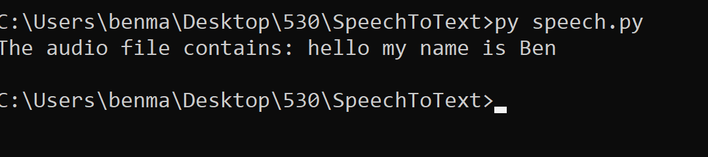

# Project 4: Speech To Text
-Benjamin Marin
## Design:
For the design I chose to have at most 4 process run with each API call taking up
one process. I chose three since have multiple processes is more intense and three would
be able to run on most devices with at least 4 cores. This means we can handle at most
4 API calls simultaneously

## Phase 1:  Build Queue System

## Phase 2:
#### Figuring out how to use speech to Text

#### Adding Text to Speech to queue

### References
https://pypi.org/project/SpeechRecognition/
https://realpython.com/python-speech-recognition/
